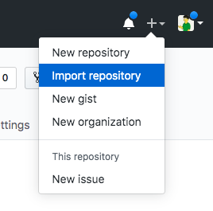

# Introduction to Finality

**Work to have done**: Submit final-for-now website, with source files, and [reflection](https://github.com/pitt-cdm/miller2019spring/issues/13)

**Plan for the Day**:
1. Reorient; reflect. (5-10 min)<!-- metaphors for learning -->
3. Transferring ownership of project repos
2. Review: course goals and final portfolios (10-15 min)
4. Studio: make plans for final portfolio, introduction
5. EXT: Start homework

## 1. Breathe; reflect. (5-10 min)

Congratulations on reaching the final week of classes! Over the last fourteen weeks, you've composed with sound, with image, with code, and with each other.

As I've said before, one of my biggest goals is to help you feel more empowered to learn digital skills _across contexts_, not just for particular applications or tools. And, as I've also said before, one way to think about that is through **metaphor** (or, more specifically, simile).

   <ol>
      <li>What was it <em>like</em> to compose as a team? To what other activities might you compare it? <!-- If it's like team sports, for example, was it more like volleyball or gymnastics – or relay racing? Was it like a dance? A bus ride? A group run? Were you and your teammates a construction crew? A family? The United Nations? --> Let your mind wander for a minute, and see what comes to mind when you start off thinking about the <em>process</em> of working collaboratively on your proposal, managing the project through interim plans and check-ins, and building or revising the product itself.</li>
      <li>Would you use the same metaphor for the other kinds of digital composing you've used this semester? If not, what other metaphor would you propose?</li>
      <li><em>Within the metaphors</em> you've come up with, what strategies would help you continue improving? What strategies might that suggest in real life, i.e. outside of the metaphor?</li>
   </ol>

Take 5ish minutes to think on the page. I won't collect this, but I will suggest that you return to these when writing your end-of-semester reflection – over the next week! – and I will ask for some volunteers to share in a few minutes.

EXT: What personal skillsets do you feel like you now possess, that you might offer to a team of digital media composers?

Let's hear at least 2-3 of these before we move on; they might spark some ideas for others!

## 2. Transferring ownership of large file storage

The main thing to work on today is preparing for the final portfolio, but there is one more thing I'd like to accomplish by the end of the semester – and today's as good as any to start.

Apparently when you fork a project on GitHub that uses Git-LFS for large file storage, the data stored by every downstream fork counts against the storage quota of the owner of the original repository. _In other words, I'm currently storing **all** the large files for your soundscapes and visual arguments._ I'm fine doing that for one semester, but I can't maintain it in perpetuity, because it starts to add up to real money.

So I'm asking you to **"detach" your repositories from the fork tree** before the end of the semester. Here's how:

<ol>
   <li>Open each project repo you forked from an assignment and copy its URL.</li>
   <li>In the GitHub taskbar, at the top right, click the <strong>+</strong> menu and choose the "Import repository" option.

   
   </li>
   <li>Paste in the URL from step 1, give the project a name, and begin import. It'll take at least a few minutes.</li>
   <li>When you're notified that the import is successful, open it up to confirm that you still have your full project history.</li>
   <li>Finally, delete the forked repository you started with in step 1, confident that you're not losing any of your work.</li>
</ol>

## 3. Review: course goals and final portfolios (10-15 min)
